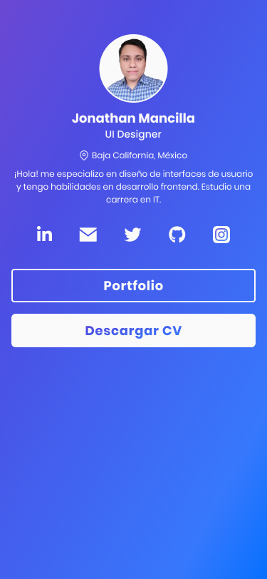

 
 
    
 
 

 El **[archivo de Figma](https://www.figma.com/file/gMkZ9NRkEuP0TS5AKvYCdj/cv-mancilla?node-id=44%3A434)** aquí

## About
Maqueté un **link website** con informacion de contacto, portafolio y my CV descargable.

## Stack
-  **HTML**
-  **CSS**
-  **Figma**

## Website
- **[https://cvmancilla.vercel.app/](https://cvmancilla.vercel.app/)**